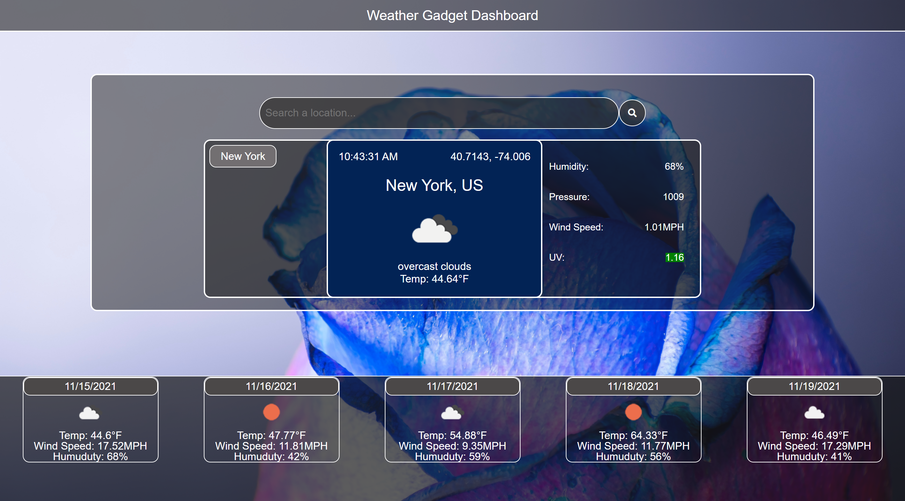

# Weather Gadget

    
    

    
    
    
    
    
    

## Overview
A simple fun weather dashboard created with HTML, CSS, Bootstrap, Javascript, jQuery, and OpenWeather API.

Search any city and the Blue Rose Weather Gadget will use the OpenWeather API to present a 7 day weather 
forecast as well as humidity and wind speeds.

## Table of Contents
- [Overview](#overview)
- [Authors](#authors)
- [Preview](#preview)
- [Features](#features)
- [Demo](#linktodeployedpage)
- [Preview](#preview)
- [Repo](#linktodeployedrepo)
- [Contribution](#contribution)
- [License](#license)
- [Bugs](#bugs)

## Authors
- Author: Sophia
- [Sophia](https://github.com/soph-k)
- Version 1.1

## Features
- HTML
- CSS
    - Bootstrap
- Javascript
    - jQuery
- OpenWeather API

## Link to Deployed Page
[Demo Live](https://soph-k.github.io/sophk_weather_gadget/)

## Preview

    
## Link to Deployed Repo
[Repo](https://github.com/soph-k/sophk_weather_gadget)

## Contribution
Contributions are accepted. Feel free to fork without permission.

## License
This project is under the MIT license.

### Questions
For questions about this project, please review my GitHub repo at [soph-k](https://github.com/soph-k) or contact me on Github.
 

### Bugs
There are currently no known bugs within this file.
    
